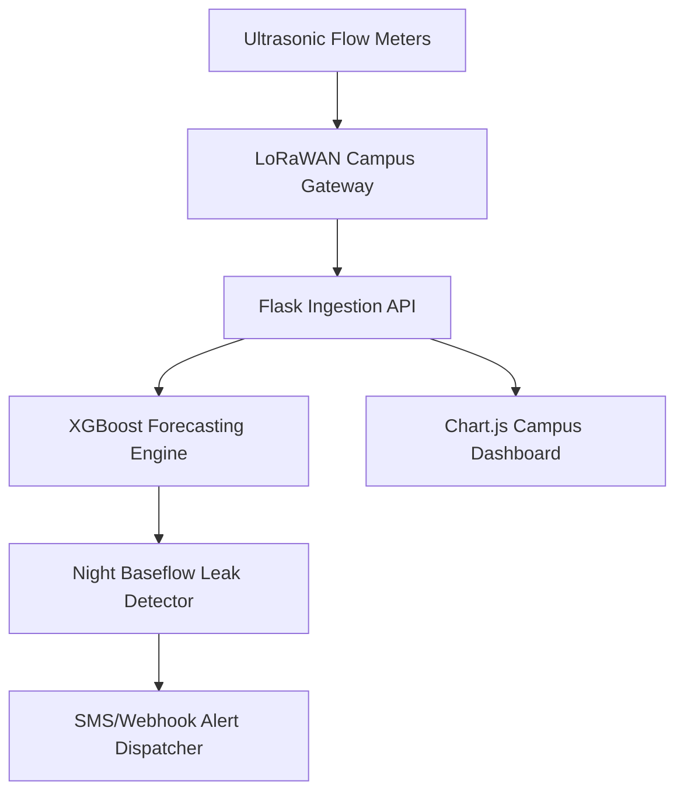

# Hydrolytics - System Architecture & Telemetry Pipeline

```mermaid
graph TD
    FlowSensors[Ultrasonic Flow Meters] --> LoRaGateway[LoRaWAN Campus Gateway]
    LoRaGateway --> FlaskAPI[Flask Ingestion API]
    FlaskAPI --> XGBoostModel[XGBoost Forecasting Engine]
    XGBoostModel --> LeakDetector[Night Baseflow Leak Detector]
    LeakDetector --> AlertEngine[SMS/Webhook Alert Dispatcher]
    FlaskAPI --> WebDashboard[Chart.js Campus Dashboard]
```
